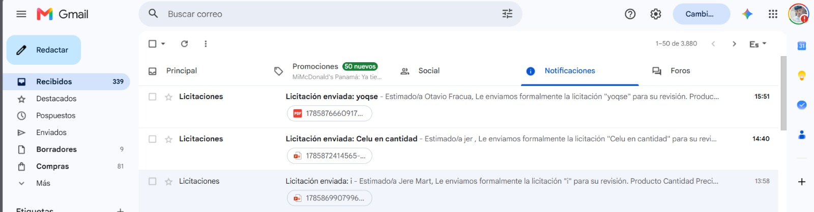
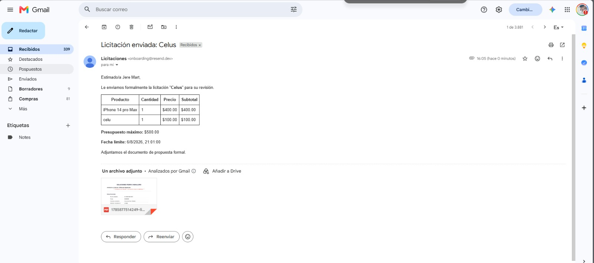
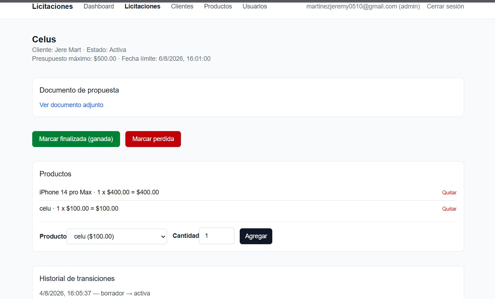
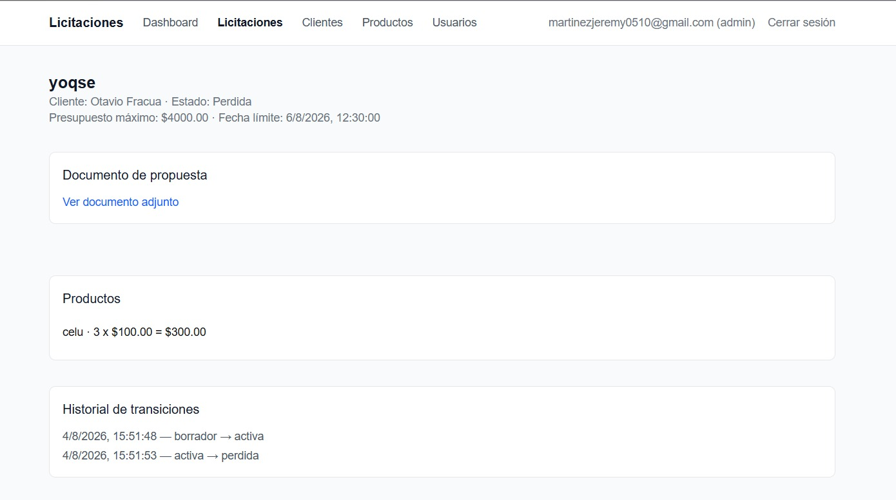
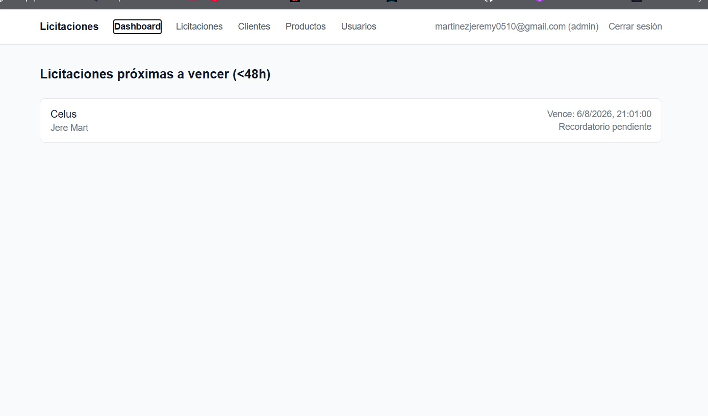
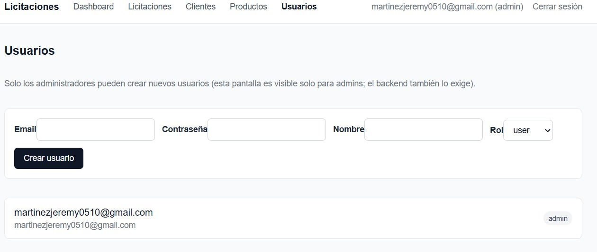

# Sistema de Gestión de Licitaciones

Prueba técnica: sistema para redactar licitaciones, adjuntarles una propuesta,
enviarlas formalmente a un cliente (con email real y adjunto), darles
seguimiento hasta su fecha límite (con recordatorio automático), resolverlas
(ganada/perdida) y, si se ganaron, facturarlas y cobrarlas hasta saldar —
todo auditado paso a paso.

**Despliegue:** https://prueba-tecnica-jimyplay1.vercel.app

> Usar siempre esta URL (dominio fijo de Production, sin hash de deployment).
> Las URLs con hash (`prueba-tecnica-<hash>-jimyplay1.vercel.app`) quedan
> congeladas en el deployment del momento en que se generaron y no reciben
> actualizaciones de commits posteriores — nos pasó factura durante las
> pruebas: un fix ya pusheado no se veía porque se seguía probando contra
> una de esas URLs vieja.

## Stack

- **Next.js 16** (App Router, TypeScript) — full-stack, un solo repo/deploy.
- **Supabase**: Postgres + Auth (email/password) + Storage (documentos de propuesta).
- **Resend**: email transaccional con adjuntos.
- **`pg_cron` + `pg_net`**: job programado para vencimiento automático y
  recordatorio, corriendo dentro de Postgres (no depende de que la app esté
  desplegada ni de límites de cron de la plataforma de hosting).
- **Vercel**: deploy del frontend/API.

## Arquitectura

La máquina de estados y las reglas de negocio están implementadas como
**triggers de Postgres** (`supabase/migrations/0001_init.sql`) — son la
fuente de verdad real, porque también deben cubrir las transiciones
automáticas que dispara el cron (vencimiento, auto-cobro), no solo las que
pasan por la API. La capa de dominio en `lib/domain/licitaciones/` (
`state-machine.ts`, `validators.ts`, `service.ts`) espeja esas mismas reglas
únicamente para devolver errores legibles antes de golpear la base de datos;
si un trigger rechaza algo que la app no anticipó, el error de Postgres
(`errcode 22023`) se traduce igual a un 409 en `lib/api/errors.ts`. Ese mismo
archivo también traduce errores de Supabase Storage (forma distinta a los de
Postgrest — `status`/`statusCode` en vez de `code`) para que una subida
fallida muestre el motivo real en vez de un 500 genérico.

**Subida de documentos: directo del navegador a Storage.** Las funciones
serverless de Vercel rechazan cualquier request de más de ~4.5MB
(`FUNCTION_PAYLOAD_TOO_LARGE`) antes de que el código de la app la vea — un
PDF real nunca pasaría por una ruta que reciba el archivo. Por eso el
navegador sube el archivo directo a Supabase Storage con el cliente de
sesión (`lib/supabase/client.ts`), y `POST /api/licitaciones/[id]/documento`
solo recibe el path resultante (un JSON chico) para validar la regla de
negocio (`borrador`) y guardar la URL pública — el archivo en sí nunca pasa
por nuestra función.

```
supabase/migrations/     Esquema, triggers, RLS, cron (fuente de verdad)
lib/domain/licitaciones/ Máquina de estados + reglas de negocio (espejo, UX)
lib/supabase/            Clientes Supabase (sesión, browser, service-role)
lib/auth/session.ts      getSessionUser() / requireAdmin()
lib/api/errors.ts        Mapeo de errores de dominio y de Postgres a HTTP
lib/email/               Cliente Resend + template del correo de envío
app/api/                 Endpoints REST
app/(dashboard)/         UI (requiere sesión, la guarda proxy.ts)
app/(auth)/login/        Login
proxy.ts                 Middleware (Next.js 16 renombró middleware.ts a proxy.ts)
```

### Máquina de estados

`borrador → activa → finalizada → por_cobrar → cobrada`, más `activa → perdida`
(manual o automática). Solo esas 5 transiciones son válidas; cualquier otra
combinación se rechaza. Cada cambio de estado — incluidos los automáticos del
cron — queda registrado en `historial_transiciones` (usuario `null` = sistema).

### Reglas de negocio (todas aplicadas en triggers)

- El total de productos de una licitación no puede superar su presupuesto máximo.
- Solo se puede enviar (`borrador → activa`) con documento de propuesta adjunto.
- El documento de propuesta solo puede subirse o quitarse (para reemplazarlo) mientras está en `borrador`.
- Al enviar, se dispara un email real al cliente con el resumen y el documento adjunto.
- Productos bloqueados (no se pueden agregar/quitar) en `finalizada`, `por_cobrar`, `cobrada`, `perdida`.
- Pagos solo en `por_cobrar`; un pago no puede superar el saldo pendiente.
- Al llegar el saldo a $0, la licitación pasa automáticamente a `cobrada` — ya
  sea porque los pagos lo saldaron, o porque se facturó directamente por $0
  (ej. sin productos cargados): en ese caso no hay pago que registrar, así
  que el propio paso a `por_cobrar` dispara el auto-cobro inmediato.
- Job programado (`pg_cron`, cada 15 min): `activa` con `fecha_limite` vencida → `perdida`;
  `activa` con menos de 48h para vencer → recordatorio por email (una sola vez, vía `reminder_sent_at`).

### Autenticación y roles

Supabase Auth (email/password). `public.usuarios` espeja `auth.users` vía
trigger, con `role` (`admin`/`user`). "Solo admins crean usuarios" está
garantizado en dos capas: el endpoint `POST /api/usuarios` verifica el rol
del que llama, **y** la tabla `usuarios` no tiene política RLS de `INSERT`
para `authenticated` — solo es escribible con el cliente service-role, así
que ni un bypass del chequeo de la app permitiría crear usuarios sin pasar
por ese endpoint.

### Simplificación deliberada de RLS

Es una herramienta interna de un solo tenant; el enunciado no pide reglas de
ownership por fila. Las políticas RLS de `clientes`/`productos`/`licitaciones`/etc.
son `to authenticated using (true)` — cualquier usuario autenticado puede
leer/escribir. La seguridad real de las reglas de negocio vive en los
triggers (ver arriba), no en RLS. Esto se documenta acá explícitamente como
decisión de alcance, no como descuido.

`get_advisors` (Supabase) señala además, y se acepta por la misma razón:
- El bucket `propuestas` permite listar sus objetos a cualquier `authenticated`
  (necesario para que `enviar` pueda descargar el documento por su path).
  No expone nada que esas mismas políticas de tablas no expongan ya.
- `pg_net` queda instalado en el schema `public` — Postgres no permite
  reasignarle schema a esa extensión (`ALTER EXTENSION ... SET SCHEMA`
  falla explícitamente para `pg_net`), así que es un warning inevitable
  con este mecanismo de cron.

## Setup local

1. `npm install`
2. Copiar `.env.local.example` a `.env.local` y completar:
   - `NEXT_PUBLIC_SUPABASE_URL`, `NEXT_PUBLIC_SUPABASE_ANON_KEY`: del proyecto Supabase (Project Settings → API).
   - `SUPABASE_SERVICE_ROLE_KEY`: idem, **secreta**, no exponer en el cliente.
   - `RESEND_API_KEY`: de [resend.com](https://resend.com) (plan gratuito). Solo la usa el envío inicial (con adjunto); el recordatorio del cron usa su propia copia guardada en Supabase Vault (ver abajo).
3. Aplicar las migraciones de `supabase/migrations/` al proyecto Supabase (en orden — ya aplicadas al proyecto de desarrollo de esta prueba; si se parte de un proyecto Supabase nuevo, aplicarlas con la CLI de Supabase o pegándolas en el SQL Editor del dashboard, en orden numérico).
4. Guardar la API key de Resend en Vault para que el cron pueda enviar recordatorios:
   ```sql
   select vault.create_secret('re_xxxxxxxx', 'resend_api_key');
   ```
5. En el dashboard de Supabase → Authentication → Providers → Email: desactivar **"Allow new users to sign up"** (el único alta de usuarios debe ser vía `POST /api/usuarios`, admin-gated).
6. Crear el primer admin (bootstrap manual, ya que nadie más puede crear el primero):
   - Dashboard → Authentication → Users → Add user (email/password).
   - `update public.usuarios set role = 'admin' where email = 'tu-email@ejemplo.com';`
7. `npm run dev` y entrar con ese usuario en `http://localhost:3000`.

## Nota sobre el remitente de Resend (plan gratuito)

Con el sender por defecto `onboarding@resend.dev` (sin dominio propio
verificado), Resend **solo entrega a la dirección con la que se creó la
cuenta**. Para que el "cliente" de una licitación de prueba reciba el email,
su campo `email` debe ser esa misma dirección. Si se quiere enviar a
cualquier destinatario, hay que verificar un dominio en
resend.com/domains y usar un `from` de ese dominio.

## Evidencia de las integraciones reales

**Verificado en producción, con uso real (no solo pruebas por API/SQL):**

- **Flujo completo end-to-end** probado desde el navegador contra
  `https://prueba-tecnica-jimyplay1.vercel.app`: alta de cliente y producto,
  creación de licitación (borrador), agregar productos, subir documento de
  propuesta (PDF real de 5MB), enviar al cliente, marcar finalizada,
  facturar, registrar pagos parciales (con rechazo confirmado de un pago que
  excedía el saldo), auto-cobro al saldar, e historial de transiciones
  completo y correcto en cada caso.
- **Email con adjunto**: recibido de verdad por el usuario, con el documento
  adjunto, al enviar una licitación real desde la UI.
- **Storage**: documento real accesible vía su URL pública
  (`/storage/v1/object/public/propuestas/...`).
- **Recordatorio automático del cron**: verificado que el camino
  `pg_cron → pg_net → Resend` responde `200` con un `id` de mensaje real de
  Resend (`net._http_response`), y que ambos jobs (vencimiento y
  recordatorio) corren cada 15 min de forma continua en producción
  (`cron.job_run_details`), independientemente del estado del deploy.
- **Deploy en Vercel**: público y funcional — `/` redirige a `/login`,
  la API rechaza requests sin sesión con 401.

**Bugs reales encontrados probando el flujo y ya corregidos:**
- Licitaciones facturadas por $0 (sin productos cargados) quedaban trabadas
  en `por_cobrar` para siempre — arreglado con un trigger que las auto-cobra
  (`0007_autocobrar_facturado_cero.sql`).
- No había forma de editar un cliente ya creado (el enunciado solo pedía
  alta y listado) — se agregó `PATCH /api/clientes/[id]` porque bloqueaba
  probar el envío con un email mal cargado.
- Subir un PDF de varios MB fallaba con un error genérico porque Vercel
  rechaza requests de más de ~4.5MB antes de que la app los vea — se movió
  la subida a directo-navegador-a-Storage.

### Capturas

| | |
|---|---|
|  **Inbox real**: 3 correos de "Licitación enviada" recibidos, cada uno con su PDF adjunto. |  **Email con adjunto**: resumen de productos/presupuesto/fecha límite y el documento de propuesta adjunto, generado por `enviar`. |
|  **Licitación activa**: documento adjunto, productos cargados, y las acciones válidas para ese estado (finalizar/perder). |  **Historial de transiciones**: una licitación en `perdida`, con el registro completo `borrador → activa → perdida`. |
|  **Dashboard**: panel de licitaciones activas a menos de 48h de su fecha límite. |  **Usuarios**: alta de usuarios admin-gated (backend y UI). |

## Pendientes

Ninguno.
